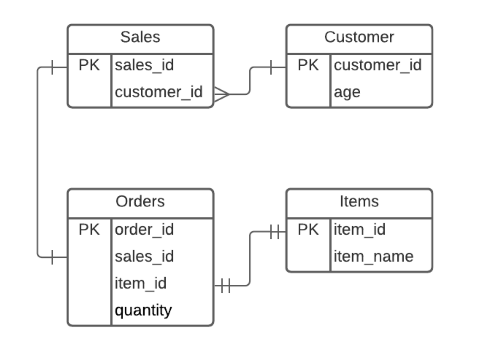

# marketing-pipeline-xyz

# Overview
This project helps the marketing analyst understand their biggest product(s) in the market in certain age brackets.
Here, we're going to find the number of products each customer bought within the age range of 18 to 35 bought over a period of time.

NOTE: The received database was corrupted so I created my own, so I've not provided any output CSV files. I've provided the steps to follow to produce the necessary output files 

# Getting started
* Set up your environment using `python -m venv my_env`
* Activate your environment
    * Windows: `my_env\Scripts\activate`
    * Mac/Linux: `source my_env/bin/activate`
* Install necessary packages from the requirements.txt file with `pip install -r requirements.txt`
* Create a folder in root directory `data` and place your sqlite's .db file in the folder and rename it to `Data Engineer_ETL Assignment.db`. Or if you wish to generate a random database based on the given schema, you can run `python db_creator.py` which will create a database in the root directory with the name `Data Engineer_ETL Assignment.db`, move this to data and you'll be set.
* We're ready to run the script, execute: `python main.py`

The output files are produced inside the `output` folder.

# Developer's guide
## Database Schema
The database is based off of the schema provided in the problem statement, below is the schema that's been assumed.


## Explaination of the solution
The SQL of the solution is as follows:
```
SELECT
    c.customer_id AS Customer,
    c.age AS Age,
    i.item_name AS Item,
    SUM(o.quantity) AS Quantity
FROM
    Orders o
    INNER JOIN Sales s ON (s.sales_id = o.sales_id)
    INNER JOIN Items i ON (i.item_id = o.item_id)
    INNER JOIN Customer c ON (c.customer_id = s.customer_id)
WHERE
    c.age BETWEEN 18 AND 35
    AND o.quantity IS NOT NULL
GROUP BY
    c.customer_id, c.age, i.item_name
HAVING
    SUM(o.quantity) > 0
ORDER BY
    Customer, Age, Item, Quantity
```
* We join all the tables and filter on the age of the customers
* Group them by the 3 columns that don't have a aggregation on them.
* We remove any rows that added upto 0 quantity.
* Finally, we order the solution to ensure our output files are the exact copy no matter which solution we pick, the SQL way or the pandas way.

## SQL solution
* The SQL solution location: `src/sql_solution.py`
* It takes the SQL from a utility module: `utils/sql_properties.py`
* You can simply modify the SQL statement in the file to modify the SQL logic inside `sql_properties.py`.
* This file doesn't run indepenently as there is a relative module reference in it, which keeps in mind that the all the scripts are run from the root.

## Pandas solution
* The pandas solution location: `src/pandas_solution.py`
* It imports all tables as dataframes from a utility module: `utils/pandas_properties.py`
* To add or remove table, you can change the list `table_names` in the `pandas_properties.py` file.
* Any kind of logical changes will require you to modify the file `pandas_solution.py`
* This file doesn't run indepenently as there is a relative module reference in it, which keeps in mind that the all the scripts are run from the root.